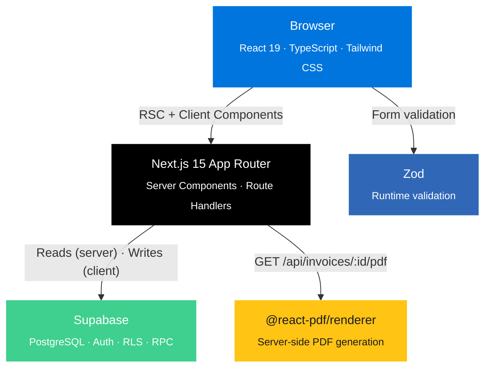

<div align="center">

# acclownting

### Invoicing for Humans Who Just Want It to Work

[](https://nextjs.org/)
[](https://www.typescriptlang.org/)
[](https://supabase.com/)
[](https://github.com/Peleke/acclownting/actions/workflows/ci.yml)
[](https://opensource.org/licenses/MIT)

**Create invoices. Post payments. Run reports. That's it.**


[Get Started](#quick-start) · [Features](#features) · [Architecture](#architecture) · [Contributing](#contributing)

---

</div>

## The Problem

Every invoicing app eventually becomes an ERP. Features creep in. The UI gets buried under dashboards, integrations, automations, and a settings page with 47 tabs. You just wanted to send Sandra an invoice for the clown you hired.

## The Solution

**acclownting** is a multi-user invoicing app that does exactly what you need and nothing else:

- Create client records
- Create invoices with line items, tax, and notes
- Generate printable PDF invoices
- Post payments against invoices (partial or full)
- Run reports: what each client owes, what you've earned, who's overdue
- Role-based access with admin invites and self-service signup

That's the whole product. On purpose.

---

## Features

### Client Management
Create and search clients by name. Each client has a detail page showing contact info, invoice history, and full payment history. One click to create a new invoice pre-filled for that client.

### Invoicing
Create invoices with multiple line items, configurable tax rates, and optional notes. Edit invoices after creation. Override status manually when life doesn't follow the happy path. Download or print PDF invoices that look professional enough to send to actual humans.

### Payments & Status Tracking
Post partial or full payments against any invoice. Invoices automatically transition through `draft > sent > partial > paid` as payments come in. Past-due invoices get flagged as `overdue` automatically. Delete payments if you made a mistake — the balance recalculates.

### Reporting
Two reports, both useful:
- **Revenue Report** — total earned and owed for any date range (defaults to current month)
- **Client Balances** — what each client owes, with overdue clients flagged in red

### Multi-User Auth
Admin users invite new members. Self-service signup available. Session-based auth via Supabase with cookie management. Role-based access control (admin vs. member).

---

## Screenshots & Videos

See **[SHOWCASE.md](./SHOWCASE.md)** for full screenshots, recorded videos, and a traceability matrix mapping every recording back to the original requirements.

To regenerate recordings locally:

```bash
npx playwright test --config playwright.showcase.config.ts
```

---

<div align="center">

# Part II: Technical Documentation

*For engineers, contributors, and the curious*

</div>

---

## Architecture



---

## Quick Start

### Prerequisites

- Node.js 20+
- npm
- Supabase account ([free tier works](https://supabase.com))

### Installation

```bash
git clone https://github.com/Peleke/acclownting.git
cd acclownting
npm install
cp .env.example .env.local
```

### Environment Configuration

```bash
# .env.local

# Required
NEXT_PUBLIC_SUPABASE_URL=your-project-url
NEXT_PUBLIC_SUPABASE_ANON_KEY=your-anon-key
SUPABASE_SERVICE_ROLE_KEY=your-service-role-key

# Optional (E2E testing)
BYPASS_AUTH=false
```

### Run Development Server

```bash
npm run dev
```

Open [http://localhost:3000](http://localhost:3000)

---

## Project Structure

```
acclownting/
├── src/
│   ├── app/
│   │   ├── (auth)/              # Login, signup pages
│   │   ├── (protected)/         # Authenticated routes
│   │   │   ├── dashboard/       # Main dashboard with balances
│   │   │   ├── clients/         # Client CRUD + detail pages
│   │   │   ├── invoices/        # Invoice list, create, edit, detail
│   │   │   ├── reports/         # Revenue + balance reports
│   │   │   └── admin/           # User management (admin only)
│   │   └── api/                 # Route handlers (PDF, admin invite)
│   ├── components/
│   │   ├── ui/                  # Design system primitives
│   │   ├── invoice-form.tsx     # Create/edit invoice form
│   │   ├── client-form.tsx      # Client create/edit modal
│   │   ├── payment-form.tsx     # Payment recording form
│   │   └── report-filters.tsx   # Date range filter controls
│   ├── lib/
│   │   ├── supabase/            # Server + client Supabase factories
│   │   ├── schemas.ts           # Zod validation schemas
│   │   ├── types.ts             # TypeScript type definitions
│   │   └── utils.ts             # Currency formatting, calculations
│   └── tests/
│       ├── components/          # Component unit tests
│       ├── integration/         # API route tests
│       ├── unit/                # Schema + utility tests
│       └── helpers/             # Test mocks and fixtures
├── e2e/                         # Playwright E2E tests
│   ├── flows/                   # Multi-page user flow tests
│   └── showcase/                # Video + screenshot recordings
└── supabase/                    # DB schema + seed data
```

---

## Commands

```bash
# Development
npm run dev              # Start dev server (localhost:3000)
npm run build            # Production build
npm run lint             # ESLint
npm run typecheck        # TypeScript strict checking

# Testing
npx vitest run           # Run 181 unit/integration tests
npx playwright test      # Run 45 E2E smoke tests

# Showcase recordings
npx playwright test --config playwright.showcase.config.ts

# All checks (what CI runs)
npm run typecheck && npm run lint && npx vitest run && npx playwright test
```

---

## Test Coverage

| Category | Count | What's Covered |
|----------|-------|----------------|
| **Unit** | 120 | Schemas, utilities, currency math, date formatting |
| **Component** | 54 | All forms, UI primitives, status badges, modals |
| **Integration** | 7 | PDF API, admin invite API, auth middleware |
| **E2E Smoke** | 29 | Every page loads, nav works, forms render |
| **E2E Flow** | 16 | Invoice lifecycle, payments, PDF download, reports |
| **Total** | **226** | |

---

## Contributing

```bash
git clone https://github.com/Peleke/acclownting.git
cd acclownting
npm install
npx vitest run && npx playwright test
```

1. Fork the repository
2. Create a feature branch (`git checkout -b feature/amazing-feature`)
3. Commit your changes
4. Push and open a Pull Request

---

## License

MIT License — see [LICENSE](./LICENSE) for details.

---

<div align="center">

**Invoicing software doesn't need to be complicated.**

**acclownting is proof.**

[Back to top](#acclownting)

</div>
